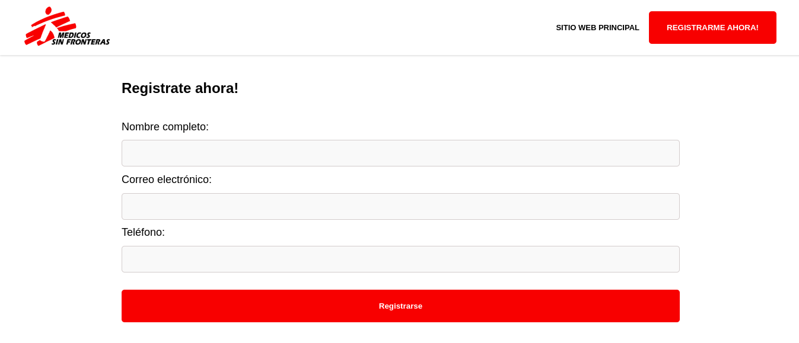
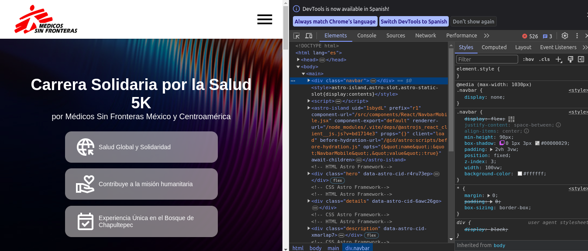
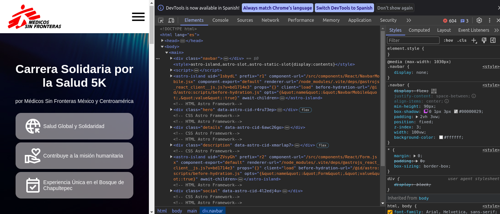

# Landing Page- Médicos Sin Fronteras

## Marco de trabajo Astro JS

#### Comandos para ejecutar proyecto


```sh
npm run dev -- correr servidor 
```


> 🧑‍🚀 **Sobre el proyecto** 







## 🚀 Tecnologías

+ Supabase (Storage)
+ AstroJS
+ ReactJS
+ BEM
+ CSS

## 🚀 Proyecto Estructura

Se siguió la siguiente estructura

```text
/
├── public/
│   └── favicon.svg
├── src/
│   ├── components/
│   │   └── Astro
|   |   └── React
│   ├── layouts/
│   │   └── Layout.astro
│   └── pages/
│       └── index.astro
└── package.json
```

##  👨‍💻  Requerimientos

SEO
+ Se colocaron etiquetas meta en head.
+ Imágenes con nombres descriptivos y descripción alt.
+ Términos relevantes para el SEO, como "Carrera Solidaria por la Salud", "Médicos Sin Fronteras", "Ciudad de México", "Bosque de Chapultepec" y "Registro".

Diseño

+ Se siguió la guía de colores de Médicos Sin Fronteras, diseño con héroe y minimalista.
+ Se diseñó una propuesta en Figma.

Responsivo

+ Se añadió menú móvil.
+ Se añadieron medidas responsivas para escritorio, tabletas y móviles.

Código

+ Se utilizó la metodología BEM para los estilos.
+ Se comentó el código para ser explicativo.
+ Se separaron los componentes en carpetas de Astro y React.


## 🧞  Más Comandos

All commands are run from the root of the project, from a terminal:

| Command                   | Action                                           |
| :------------------------ | :----------------------------------------------- |
| `npm install`             | Installs dependencies                            |
| `npm run dev`             | Starts local dev server at `localhost:4321`      |
| `npm run build`           | Build your production site to `./dist/`          |
| `npm run preview`         | Preview your build locally, before deploying     |
| `npm run astro ...`       | Run CLI commands like `astro add`, `astro check` |
| `npm run astro -- --help` | Get help using the Astro CLI                     |

## 👀 Depliegue

[Figma](https://www.figma.com/file/ECt31JnjRoADFCZwz3PIz8/Medicos-Sin-Fronteras?type=design&node-id=0%3A1&mode=design&t=h2kDdKpmSW2PTAk1-1)  Ver diseño

[Vercel](https://medicos-sin-frontera.vercel.app/)  Ver Despliegue
